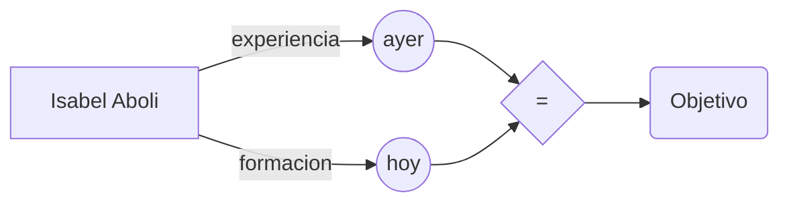

# Bienvenido/a a mi pequeño espacio!

# Sobre Mi

Hola, mi nombre es Isabel Aboli, actualmente estoy aprendiendo desarrollo Full Stack con FactoriaF5 Gijón y me emociona poder de compartir mi experiencia contigo. 
Me apasiona el desarrollo web y estoy trabajando duro para convertirme en una programadora versátil, dado que me encanta trabajar en proyectos desafiantes y aprender nuevas tecnologías. 

## Experiencia profesional

Mi experiencia profesional se ha desarrollado en el ámbito de la atención al cliente, alternando desde hace años el sector de la hostelería como camarera extra en banquetes, eventos y congresos, con el trabajo eventual como repartidora y atención al cliente en oficina para la Sociedad Estatal de Correos y Telégrafos SA.
Ambos sectores profesionales me han aportado habilidades para trabajar en equipo, comunicación proactiva y tolerancia del estrés en situaciones con abundante flujo de trabajo.   

## Objetivos

En la actualidad estoy reinventándome a mi misma a través de la formación, para mejorar profesionalmente en un ámbito que me permita desarrollar las destrezas adquiridas por la experiencia y aquellas que me aporten la formación global que realizo en estos momentos.  

Mi user flow:

